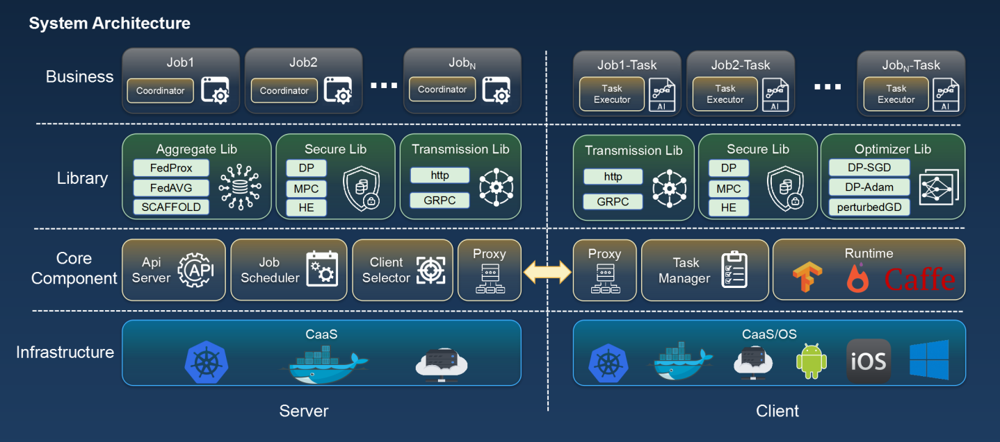

# Architecture

The architecture of Neursafe FL is shown in the figure above, which is divided into two parts: Server and Client. The main functions of each component are described as follows:

- **Infrastructure**: Provides an infrastructure platform for Nerusafe FL to run. The server side supports deployment and operation on CaaS (Container as a Service). Currently, the supported CaaS is Kubernetes, and Neursafe FL supports the extension of other CaaS. The client supports CaaS (enterprise or inter-institutional silo scenario), container and OS, and the OS currently only supports Linux.
- **API Server**: A unified entry for rest requests, which forwards user requests to backend service entities, such as Job Scheduler.
- **Job Scheduler**: Responsible for the management and scheduling of federated learning jobs, specifically scheduling federated jobs according to the resources of the federated system, assigning clients to federated jobs, and dynamically starting the Job Coordinator to complete the federated training of jobs.
- **Client Selector**: Responsible for client registration and management, respond to Coordinator's job resource requests, and assign training clients to federated jobs according to the selection algorithm.
- **Proxy**: The functions of the Proxy components of the server and the client are similar. They complete the reverse proxy function of external messages，forward the corresponding messages to the Job Coordinator or Task Manager.
- **Task Manager**: It is the client daemon, which is responsible for the client's registration and status reporting to the server, and process the task request from the server, and is responsible for the scheduling of the local task.
- **Runtime**: This refers to the existing machine learning framework. Neursafe FL uses the current mainstream machine learning framework as the executor for local training, which can maintain the development habits of the existing framework to the greatest extent and reduce the cost of federated migration. Currently supports Pytorch, Tensorflow/Keras.
- **Aggregate Lib**: The encapsulation of aggregation algorithms, integrating multiple federated aggregation algorithms, and supporting custom extensions.
- **Secure Lib**: The privacy-preserving computation algorithm library, which encapsulates the privacy-preserving computation protocol, is used to protect the security of intermediate data and avoid obtaining user privacy data through reverse analysis and other attack methods.
- **Transmission Lib**: The encapsulation of the transmission protocol, currently supports Http and Grpc two transmissions.
- **Optimizer Lib**: A wrapper for federated-specific optimizers generated for federated aggregation or data security algorithms.
- **Coordinator**: It is dynamically started by the Job Scheduler during job scheduling, and is responsible for the coordination and organization of federated training for the job, including requesting clients to participate in training, dispatching initial models, and aggregating client models.
- **Task Executor** : A part of the client, responsible for the execution of each round of training tasks of the federated job. The task manager receives the server-side task request is dynamically created, completes the local training of the current round of the model locally, and reports the training results to the server .

In addition to the above components, Neursafe FL requires some basic support components, including:

- **Database**: The system uses the database to store job configuration and status information, as well as model information, and supports MongoDB or Postgresql.
- **Distributed File System(DFS)**: The server side uses a distributed file system to store models, metrics, and some intermediate data. Neursafe FL supports access to distributed file systems through S3 and POSIX file interfaces. We use Minio by default, but other DFS can be selected.
- **Model Manager**: Model warehouse, which provides model management capabilities, and can submit initial federated models to the warehouse and release models after federation training.
- **Command Line Client NSFL-Ctl**: Provides the ability to access and use Neursafe FL from the command line.

## The workflow of job scheduling

The job scheduling process is shown in the figure above, and the steps are as follows:

- User commit federated learning jobs through Rest request or command-line client.
- API Sever forward the committing message to Job Scheduler.
- Job Scheduler records job information and puts it into the scheduling queue. If system resources are satisfied, job scheduling is triggered.
- Start the Coordinator for job that meet the scheduling conditions.
- The Job Coordinator starts job execution and get clients which participate in this round of training from Selector.
- The Coordinator assign federated training tasks to selected clients.
- After the Task Manager receives the task, it starts the local Task Executor.
- The Task Executor uses the model dispatched by the Coordinator as the initial model, and uses local data to complete the model training.
- Client reports the weight delta value, statistical measurement information, etc. generated by the local training to the Coordinator.
- After receiving the models of each client, the Coordinator aggregates the models to determine whether to terminate the federated training or start the next round of training.